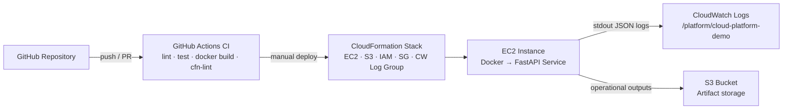

# Cloud Platform Automation on AWS

A compact, realistic cloud platform engineering portfolio project demonstrating
infrastructure as code, containerized service deployment, structured logging,
health checks, and deployment validation — all wired together with a GitHub
Actions CI pipeline.

> **Goal:** Show what a platform engineer actually does: provision infrastructure
> repeatably, deploy services reliably, and make runtime behaviour observable.

---

## Architecture



---

## What This Project Demonstrates

- **Infrastructure as Code** — EC2, S3, IAM, security group, CloudWatch log group,
  metric filter, and alarm defined in a single CloudFormation template.
- **Containerized Python service** — FastAPI app with health, readiness, metrics,
  and error endpoints; packaged with a minimal Dockerfile.
- **CI validation** — GitHub Actions runs lint, tests, Docker build, and
  `cfn-lint` on every push and pull request; no AWS credentials required.
- **Health checks and deployment validation** — `/health`, `/ready`, and
  `/metrics` endpoints validated programmatically by `validate_deployment.py`
  and `smoke_test.sh`.
- **Structured logs and CloudWatch visibility** — every log line is a JSON object
  streamed to CloudWatch Logs via the Docker `awslogs` driver, queryable with
  CloudWatch Logs Insights.

---

## Tech Stack

| Layer | Tool |
|---|---|
| Language | Python 3.11 |
| Web framework | FastAPI + uvicorn |
| Container | Docker |
| IaC | AWS CloudFormation |
| Compute | AWS EC2 (t2.micro) |
| Storage | AWS S3 |
| Auth | AWS IAM instance role |
| Observability | AWS CloudWatch Logs |
| CI | GitHub Actions |
| Lint | ruff |
| Tests | pytest |

---

## Local Run

### Python (no Docker)

```bash
pip install -r requirements.txt
uvicorn app.main:app --reload --port 8000
```

### Docker

```bash
# Build
docker build -t cloud-platform-service:latest .

# Run
docker run -d --name cloud-platform-service -p 8000:8000 cloud-platform-service:latest

# Verify
curl http://localhost:8000/health
curl http://localhost:8000/ready
curl http://localhost:8000/metrics
curl http://localhost:8000/simulate-error   # returns HTTP 500 intentionally
```

### Run tests and lint

```bash
pytest tests/ -v
ruff check app/ tests/
```

### Deployment validation (local)

```bash
python scripts/validate_deployment.py --base-url http://localhost:8000
bash scripts/smoke_test.sh http://localhost:8000
```

---

## AWS Deployment

### Prerequisites

- AWS CLI configured (`aws configure`)
- An EC2 key pair created in your target region
- A public GitHub repo (so EC2 user data can `git clone` it)

### 1. Deploy the CloudFormation stack

```bash
aws cloudformation deploy \
  --template-file infra/cloudformation.yml \
  --stack-name cloud-platform-demo \
  --parameter-overrides \
    ProjectName=cloud-platform-demo \
    KeyPairName=<YOUR_KEY_PAIR_NAME> \
    InstanceType=t2.micro \
    AllowedCIDR=<YOUR_IP>/32 \
  --capabilities CAPABILITY_NAMED_IAM \
  --region <YOUR_REGION>
```

### 2. Get the instance IP

```bash
aws cloudformation describe-stacks \
  --stack-name cloud-platform-demo \
  --query "Stacks[0].Outputs" \
  --output table
```

### 3. Wait for user data to finish (~2–3 minutes), then validate

```bash
export SERVICE_URL=http://<INSTANCE_PUBLIC_IP>:8000

python scripts/validate_deployment.py --base-url $SERVICE_URL
bash scripts/smoke_test.sh $SERVICE_URL
```

### 4. Cleanup (avoids charges)

```bash
# Empty the S3 bucket first
aws s3 rm s3://cloud-platform-demo-artifacts-<YOUR_ACCOUNT_ID> --recursive

# Delete the stack
aws cloudformation delete-stack --stack-name cloud-platform-demo
```

> See `scripts/cleanup_notes.md` for full cleanup details.

---

## Validation Output

Running `python scripts/validate_deployment.py` produces:

```
Validating deployment at: http://54.210.88.12:8000
==================================================
  [PASS] Health Check (/health)
  [PASS] Readiness Check (/ready)
  [PASS] Metrics (/metrics)
==================================================
Result: 3/3 checks passed
Status: ALL CHECKS PASSED
```

Full sample: [`outputs/validation_output_sample.txt`](outputs/validation_output_sample.txt)

---

## Logging and Troubleshooting

Every log line is a single JSON object written to stdout and captured by
CloudWatch Logs via the Docker `awslogs` log driver.

**Normal request:**
```json
{"timestamp": "2024-06-01T14:22:05.312487+00:00", "level": "INFO", "service": "cloud-platform-service", "message": "request completed", "request_id": "b7e2a091", "endpoint": "/health", "status_code": 200, "duration_ms": 1.4}
```

**Simulated error:**
```json
{"timestamp": "2024-06-01T14:24:10.119843+00:00", "level": "ERROR", "service": "cloud-platform-service", "message": "simulated error triggered", "request_id": "a3f9c1d2", "endpoint": "/simulate-error", "status_code": 500, "error_type": "SimulatedError"}
```

Full sample: [`outputs/structured_logs_sample.jsonl`](outputs/structured_logs_sample.jsonl)

### CloudWatch Logs Insights — useful queries

```
# Count errors by hour
fields @timestamp, level, endpoint, message
| filter level = "ERROR"
| stats count() as error_count by bin(1h)

# Slowest requests
fields @timestamp, endpoint, duration_ms
| filter ispresent(duration_ms)
| sort duration_ms desc
| limit 20
```

A CloudWatch metric filter counts `"level": "ERROR"` log lines and an alarm
fires when the count reaches 1 in a 5-minute window.

---

## Security and Cost Notes

| Concern | Approach |
|---|---|
| Secrets | None — no API keys, passwords, or tokens in code or environment variables |
| AWS credentials | IAM instance role with least-privilege inline policies; no static keys |
| Network | Security group allows only port 8000 and SSH; use your IP as `AllowedCIDR` |
| Cost | `t2.micro` is free-tier eligible; CloudWatch Logs ingestion is negligible at demo scale |
| Cleanup | Stack deletion removes all resources except the S3 bucket (see cleanup notes) |

---

## Resume Mapping

This project directly supports the following resume bullets:

> **"Provisioned AWS EC2, S3, IAM, and CloudFormation resources as reusable infrastructure."**
>
> → `infra/cloudformation.yml` defines all resources as code. Deployment is a
> single `aws cloudformation deploy` command, not manual console steps.

---

> **"Containerized a Python service with Docker and validated it through GitHub Actions."**
>
> → `Dockerfile` packages the FastAPI service. `.github/workflows/ci.yml` runs
> lint, tests, `docker build`, and `cfn-lint` on every push with no AWS
> credentials required.

---

> **"Added structured logging, health checks, CloudWatch visibility, and deployment validation scripts."**
>
> → `app/logging_config.py` emits JSON logs to stdout. The CloudFormation template
> routes them to CloudWatch Logs. `scripts/validate_deployment.py` and
> `scripts/smoke_test.sh` confirm the service is live after every deployment.

---

## Repository Structure

```
cloud-platform-automation-aws/
├── README.md
├── Dockerfile
├── .dockerignore
├── requirements.txt
├── app/
│   ├── main.py               # FastAPI service with health/ready/metrics/error endpoints
│   └── logging_config.py     # Structured JSON formatter
├── tests/
│   └── test_health.py        # pytest endpoint tests
├── infra/
│   └── cloudformation.yml    # Full AWS stack definition
├── scripts/
│   ├── validate_deployment.py
│   ├── smoke_test.sh
│   └── cleanup_notes.md
├── docs/
│   ├── architecture.md
│   └── output_samples.md
├── outputs/
│   ├── health_check_sample.json
│   ├── validation_output_sample.txt
│   └── structured_logs_sample.jsonl
└── .github/
    └── workflows/
        └── ci.yml
```
