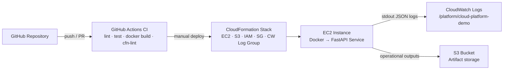

# Architecture

## Overview

This project provisions a small but realistic AWS platform environment and
deploys a containerized Python service onto it. The design prioritises
simplicity and operational visibility over complexity.

---

## Diagram



---

## Deployment Flow

1. **Developer pushes code** to GitHub.
2. **GitHub Actions CI** runs automatically:
   - `ruff` lint
   - `pytest` unit tests
   - `docker build` image
   - `cfn-lint` CloudFormation validation
3. **CloudFormation stack** is deployed manually via AWS CLI:
   ```
   aws cloudformation deploy ...
   ```
4. **EC2 user data** script runs on first boot:
   - Installs Docker
   - Clones the GitHub repository
   - Builds the Docker image locally on the instance
   - Starts the container with the CloudWatch Logs driver

> **Why clone and build on EC2?**  
> Avoids the complexity of ECR and image push/pull credentials for a demo
> project. A production system would push a versioned image to ECR and pull it
> on the instance.

---

## Runtime Flow

```
HTTP client
    │
    ▼
EC2 Security Group (port 8000 open)
    │
    ▼
Docker container (FastAPI / uvicorn)
    │
    ├── GET /health    → liveness check
    ├── GET /ready     → readiness check
    ├── GET /metrics   → operational counters
    └── GET /simulate-error → controlled error + error log
    │
    ▼ (stdout JSON logs)
CloudWatch Logs — /platform/cloud-platform-demo
```

---

## Resource Summary

| Resource | Purpose |
|---|---|
| EC2 `t2.micro` | Runs the Docker container |
| Security Group | Allows port 8000 and SSH inbound |
| IAM Role + Instance Profile | Grants EC2 permission to write CloudWatch Logs and access S3 |
| S3 Bucket | Stores deployment artifacts and operational outputs |
| CloudWatch Log Group | Receives container stdout as structured JSON |
| Metric Filter | Counts `"level": "ERROR"` log entries |
| CloudWatch Alarm | Fires when error count ≥ 1 in a 5-minute window |

---

## Key Design Decisions

- **Default VPC** — avoids VPC/subnet/routing complexity for a demo.
- **No ECR** — container is built on the instance from source; simpler credential model.
- **No database** — in-memory counters keep the service stateless and easy to restart.
- **IAM role, not static keys** — the instance receives temporary credentials automatically; no secrets in code or environment variables.
- **Structured JSON logs** — every log line is a single JSON object, making CloudWatch Logs Insights queries trivial.
